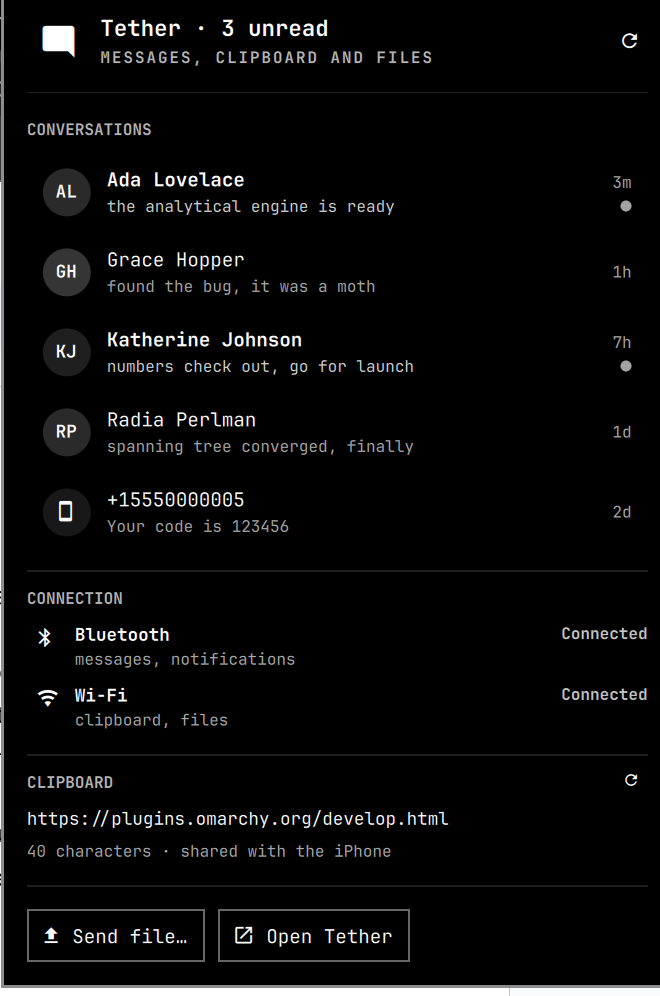
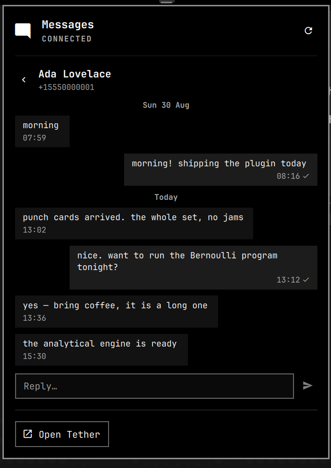

# Tether for the Omarchy bar

Your iPhone's messages in the Omarchy bar: an unread badge, your recent
conversations, and replies without leaving the keyboard.

It is a front end for [Tether](https://github.com/zackb/tether), which is what
actually talks to the phone. This plugin reads Tether's daemon and draws it in
the bar; it does no Bluetooth of its own.




## What it does

- **An unread badge in the bar.** A dot on the message glyph while anything is
  unread, and a dimmed glyph when the phone or the daemon is away.
- **Recent conversations,** newest first, with who wrote, what they said, when,
  and which are unread.
- **One conversation at a time,** with day separators, sent ticks, and messages
  laid out the way a thread reads.
- **Replies,** inline, when the phone's Messages connection is up.
- **Both transports, named separately.** Tether runs two radios that fail
  independently — Bluetooth carries messages and notifications, Wi-Fi carries
  the clipboard and files — so the panel reports each one, with the daemon's
  own explanation when something is wrong.
- **The shared clipboard,** so you can see what the iPhone would pull.
- **Send a file** to the phone from a picker, or from a script.
- **Live.** Nothing is polled. Tether pushes new messages, read receipts,
  connection changes and Wi-Fi arrivals, and the bar follows within a moment.

## Requirements

- **Omarchy** with `omarchy-shell` (the Quickshell bar).
- **Tether**, installed and running, and already paired with an iPhone. On Arch
  that is the `tether-bin` AUR package. Confirm it before installing this:

  ```bash
  tether --bt-connection     # should report the link and profiles as connected
  tether --bt-threads        # should list your conversations
  ```

  If those two are unhappy, this plugin will faithfully show you that they are
  unhappy. Tether's own README covers pairing, `--bt-setup`, and the iPhone
  permission toggles.

## Install

```bash
omarchy plugin add https://github.com/jordanful/omarchy-tether.git --enable
```

Plugins land disabled so you can read the code first; `--enable` skips that.
To place it yourself:

```bash
omarchy bar move io.github.jordanful.tether --section right
```

Remove it with `omarchy plugin remove io.github.jordanful.tether`.

## Using it

**Mouse.** Click the bar icon for the conversation list, click a conversation to
open it, click the chevron to come back. Right-click the bar icon opens Tether's
own window; middle-click refreshes.

**Keyboard.** The panel takes focus when it opens.

| Key | What it does |
|---|---|
| `j` / `k`, `↓` / `↑` | move the cursor (the first press just reveals it) |
| `Enter`, `Space` | open the conversation under the cursor |
| `l` / `→` | open the conversation under the cursor |
| `h` / `←` | back to the list |
| `r` | put the cursor in the reply box |
| `Enter` (in the reply box) | send |
| `Esc` | back to the list, or close the panel |
| `Tab` | walk to the next bar panel |

## Clipboard and files

These ride the **Wi-Fi** transport, so the panel only offers them while the
Tether app on the iPhone is open and on the same network. Both sections
disappear when it is not, rather than sitting there greyed out.

**Send a file** opens a picker (zenity), then hands the path to the daemon,
which does the transfer and reports back. The result — the daemon's own
sentence, success or failure — appears above the buttons. Files can also be
sent without the picker:

```bash
omarchy-shell tether sendFile ~/report.pdf
```

**The clipboard section** shows what the iPhone would receive if it asked for
the clipboard right now, with a button to re-read it.

**Why there is no Send Clipboard button.** Tether already mirrors the clipboard
on its own: the daemon watches the Wayland selection and pushes every copy to
the phone, and the phone pulls whenever you tap Get Clipboard in the iOS app.
Nothing local can force a push — `clipboard_set` writes the daemon's cache
*before* it writes the selection, so the watcher that would broadcast sees no
change and stays silent. (Tether's own GTK app does have a Send Clipboard
button; it sends a `clipboard_set` carrying no content, which the daemon drops
on the floor.) Showing you what is shared is the honest version of that button,
so that is what this does.

## Settings

Set them with `omarchy bar set io.github.jordanful.tether <key> <value>`, or
edit the widget's entry in `~/.config/omarchy/shell.json`.

| Key | Default | What it does |
|---|---|---|
| `hideWhenDisconnected` | `false` | Take the icon out of the bar entirely while the phone is not connected. |
| `markReadOnOpen` | `true` | Mark a conversation read, on the phone too, when you open it. |
| `showPreviews` | `true` | Show what was said in the list, not just who said it. |
| `threadLimit` | `12` | How many conversations to list (1–50). Unread ones are always listed, even past this. |
| `socketPath` | `""` | Path to `tetherd.sock`. Empty means `$XDG_RUNTIME_DIR/tether/tetherd.sock`. |

**On `markReadOnOpen`.** Opening a conversation marks it read on the iPhone,
which is what keeps the bar's badge agreeing with what you have actually seen.
Tether's own app does the same thing. Set it to `false` if you would rather the
phone's unread state be left alone — the badge will then only clear when you
read the message on the phone.

## IPC

The plugin registers the `tether` target:

```bash
omarchy-shell tether toggle
omarchy-shell tether show
omarchy-shell tether hide
omarchy-shell tether back
omarchy-shell tether openThread 'tel:+15551234567'
omarchy-shell tether sendFile ~/report.pdf
```

`openThread` jumps straight to one conversation, which makes a reasonable
keybinding for the person you talk to most. Thread keys are the ones
`tether --bt-threads` prints.

## How it works

Tether's daemon listens on a UNIX socket and speaks newline-delimited JSON.
Sending it `{"command":"subscribe"}` registers as a local subscriber, and from
then on it pushes `bt_message`, `bt_connection_changed` and `bt_message_read` as
they happen. This plugin subscribes once and asks for a conversation list only
when something tells it the list changed. There is no timer anywhere that
refreshes state.

Three decisions worth knowing about, because they are not obvious from the code:

**The socket lives in a service, not in the widget.** The bar builds one widget
instance per monitor, so a socket owned by the widget would open one
subscription per screen. The plugin declares a `service` kind, which the shell
instantiates exactly once, and each bar widget reaches it through
`bar.shell.serviceFor()`. One connection, however many monitors — verified by
looking at who actually holds the socket open.

**A retry rebuilds the socket rather than reconnecting it.** A Quickshell
`Socket` is single-use: after it disconnects, writing `connected = true` on the
same object never reconnects, and no error is emitted either. Left that way, the
bar would go dark the first time `tetherd` restarted and stay dark until the
whole shell was restarted. The reconnect timer therefore destroys the socket and
builds a new one, which does connect.

**The Wi-Fi side is pushed, not polled, too.** It would be easy to assume the
`state_snapshot` that carries connected devices has to be re-read on a timer.
It does not: the daemon emits `client_connected`, `untrusted_client_connected`
and `client_disconnected` to local subscribers, and those are what prompt a
re-read. So a phone joining the network shows up in the bar within a moment,
and an idle plugin still issues nothing.

**The unread count and the list have to agree.** `threadLimit` caps the list by
recency, but an unread conversation can be older than the cap — so the hero
could honestly report six unread while showing four of them, with no way to
reach the rest. Unread conversations are always listed, cap or no cap.

## Icons

Every glyph is a Nerd Font codepoint that was rendered and looked at before it
was used, because a fontconfig charset hit is not proof a glyph draws:
`nf-md-earbuds` (U+F1085) is reported as covered by JetBrainsMono Nerd Font and
paints the letters `LOG`. The codepoints are listed in `Model.js`.

The unread badge is a dot inside a ring of bar background rather than a bare
coloured dot. A theme is free to be monochrome — several are, with `accent`,
`bar.active` and the foreground all the same grey — and a dot of any theme
colour laid on the glyph then disappears into it. The cut-out ring is what makes
the badge read in every theme.

## Troubleshooting

**"Tether is not running."** The plugin cannot find or reach the daemon socket.
Check `tetherd` is up and that `$XDG_RUNTIME_DIR/tether/tetherd.sock` exists; if
yours lives elsewhere, set `socketPath`.

**"iPhone disconnected" / "Messages not connected."** The daemon is fine and the
phone is not. Those lines are the daemon's own wording — `tether
--bt-connection` will say the same thing with more detail. The **Reconnect**
button asks Tether to bring the link back up; if the phone never offers Messages
access, `tether --bt-solicit` is the next thing to try.

**No messages you sent from the phone.** They are not there to show. iOS
advertises a `sent` folder over MAP and then serves nothing from it — asking the
phone directly, `ListMessages("sent")` answers with an empty set while
`ListMessages("inbox")` returns messages. Tether asks for the sent folder on
every poll and files anything it gets, so a thread shows what the other person
said plus anything sent from this machine, and nothing typed on the phone. The
conversation view says so above the reply box rather than letting a
half-conversation look like a bug. Nothing here or in Tether can fix it.

**Conversations are listed but empty.** MAP is still syncing; give it a moment,
or hit refresh.

**Send file and the clipboard section are missing.** They ride Wi-Fi, and the
Wi-Fi row will say why — usually that the Tether app is not open on the phone,
or that the two are not on the same network.

**The picker does not open.** It is `zenity`; install it (`omarchy pkg add
zenity`) or send files with `omarchy-shell tether sendFile <path>` instead.

**Nothing appears in the bar at all.** `omarchy plugin list --json | grep
tether` should show it enabled, then `omarchy-shell shell rescanPlugins`. QML
errors show up in `journalctl --user -t omarchy-shell`.

## Development

`Model.js` holds every pure function — time formatting, payload shaping, echo
matching, connection wording — and imports nothing from QML, so it runs in a
plain harness:

```bash
node tests/model.test.js
omarchy plugin validate .
```

`Service.qml` owns the connection and the state; `Panel.qml` is the bar button
and the popup, and draws only what the service hands it.

Tether's daemon protocol is not documented anywhere, so the commands and events
used here were read out of `net.cpp` and then checked against a running daemon,
because the two do not always agree — `clipboard_available` is in the source but
absent from 0.2.19's snapshot, and the enable command is `bt_set_enabled` rather
than the `bt_enable` its CLI flag suggests. Anything uncertain is treated as
missing rather than assumed.

## Licence

MIT. Tether itself is a separate project with its own licence.
